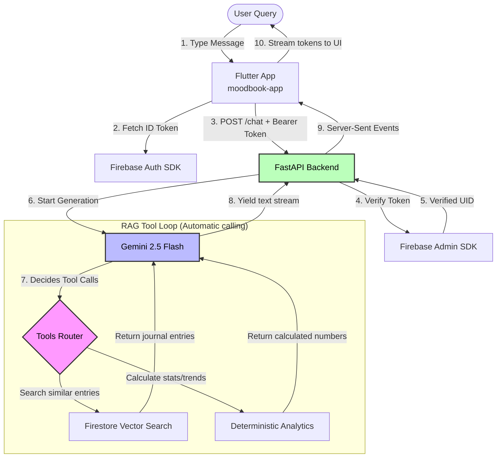

# MoodBook Backend

The companion backend service for the **MoodBook** application. It provides an Agentic RAG (Retrieval-Augmented Generation) wellness analytics assistant built with FastAPI, Firestore Native Vector Search, and Gemini 2.5 Flash.

This repository serves as the API backend for the [MoodBook Flutter Application](https://github.com/khadeejab038/moodbook-app).

---

## System Flowchart

The following diagram illustrates the lifecycle of a user query, showcasing the Firebase authentication verification and the automatic loop of the Agentic RAG tool calling:



---

## Key Features

- **FastAPI Framework:** Lightweight, asynchronous, high-performance REST API.
- **Firebase Auth Security:** Verifies incoming client request tokens (`Authorization: Bearer <ID_TOKEN>`) against the Firebase Admin SDK to ensure secure user-scoped queries.
- **Agentic RAG Tool Calling:** Uses Gemini 2.5 Flash to dynamically select and execute data tools depending on user intent.
- **Deterministic Analytics Engine:** Runs native Python algorithms (mood averages, period comparisons, activity/emotion correlations) to return mathematically correct insights instead of letting the LLM estimate numbers.
- **Firestore Vector Search:** Performs semantic search directly on user journal entries using Firestore's native `find_nearest` vector indexes, removing the need for a separate Qdrant/Pinecone instance.
- **Server-Sent Events (SSE):** Streams the synthesized conversational response back to the client in real-time.

---

## Directory Structure

```
moodbook-backend/
├── app/
│   ├── auth/         # Security and Firebase ID token middleware
│   ├── routers/      # API routes (/chat, /health)
│   ├── services/     # External integrations (Firestore, Gemini)
│   ├── tools/        # Deterministic python analysis functions
│   ├── config.py     # Environment variables schema
│   └── main.py       # FastAPI application entry point
├── scripts/          # Helper scripts (synthetic data generation, embedding backfill)
├── .gitignore
├── requirements.txt
└── README.md
```

---

## Getting Started

### Prerequisites

- Python 3.10+
- Google AI Studio API Key (for Gemini)
- Firebase Admin SDK private key (`service-account.json`)

### Installation & Run

1. Clone this repository.
2. Create a virtual environment:
   ```bash
   python -m venv venv
   source venv/bin/activate  # On Windows: venv\Scripts\activate
   ```
3. Install dependencies:
   ```bash
   pip install -r requirements.txt
   ```
4. Create a `.env` file based on configuration requirements:
   ```bash
   cp .env.example .env
   ```
   *Fill in your `GEMINI_API_KEY` and `FIREBASE_PROJECT_ID` in the `.env` file.*
5. Place your downloaded Firebase service account key in the root directory as `service-account.json`.
6. Start the development server:
   ```bash
   uvicorn app.main:app --reload
   ```